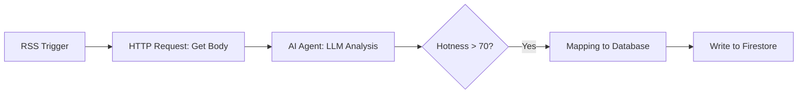

# N8N News Intelligence Pipeline Guide

이 가이드는 N8N을 활용하여 실시간 뉴스를 수집하고, AI를 통해 사건(Event)을 지능적으로 분류하여 Firestore에 저장하는 설계를 담고 있습니다.

## 1. 워크플로우 개요 (N8N Workflow)

---

## 2. AI Agent 프롬프트 전략 (System Prompt)

N8N의 AI Agent 노드에 다음 지침을 입력합니다.

### **역할**: 뉴스 분석가 및 데이터 사이언티스트
**목표**: 수집된 뉴스 기사를 분석하여 지능적인 관계도를 형성한다.

**분석 단계:**
1.  **엔티티 추출**: 기사에서 핵심 인물, 조직, 장소를 추출한다.
2.  **핫니스 점수**: 대중적 파급력을 0-100 사이로 평가한다.
3.  **사건 분류 (Clustering)**: 
    - `articles` 컬렉션의 최근 기사들을 참고하여, 이 기사가 기존에 진행 중인 사건(`eventId`)과 연관되는지 판단한다.
    - 만약 새로운 중심 흐름이라면 새로운 `eventId`를 생성한다.
4.  **이미지 프롬프트 생성**: 
    - **Portrait**: "Ink and watercolor editorial caricature, caricature style..."
    - **Scenery**: "Photorealistic cinematic shot, 35mm lens, f/1.8..."

---

## 3. Firestore 데이터 맵핑 가이드

N8N의 Firestore 노드에서 다음 필드를 맵핑합니다.

| 필드명 | 데이터 타입 | 설명 |
| :--- | :--- | :--- |
| `title` | String | 뉴스 헤드라인 |
| `body` | String | AI가 요약한 본문 (Markdown) |
| `category` | String | POLITICS, TECH 등 미리 정의된 Enum |
| `bias` | Number | AI가 분석한 정치적 편향 점수 (0-100) |
| `hotness` | Number | 핫니스 점수 (0-100) |
| `eventId` | String | 매핑된 사건 ID |
| `imageUrl` | String | 생성된 AI 이미지 URL (Firebase Storage) |

---

## 4. 로컬 테스트 및 연동

- **Webhook**: N8N의 Webhook 노드를 사용하여 수동으로 크롤링을 트리거할 수 있습니다.
- **Firebase Admin SDK**: N8N 환경에서 Firebase 연동을 위해 서비스 계정 키(JSON)를 Credential로 등록해야 합니다.
